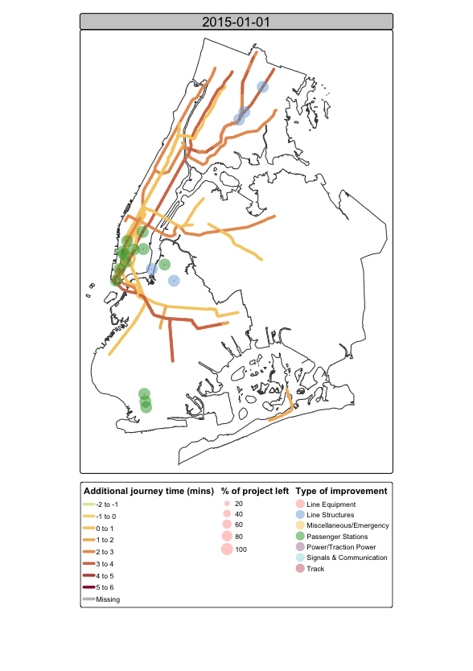

Libraries 

```{r}
library(tidyverse)
library(janitor)
library(sf)
library(terra)
library(spData)
library(spDataLarge)
library(tmap)
library(leaflet)
library(knitr)
```

Load in data and join

```{r}
location <- read_csv("data/project_locations.csv") %>% 
  clean_names()

summary <- read_csv("data/project_summary.csv") %>% 
  clean_names() %>% 
  select(-c("agency_name", "category_description", 
            "element_description", "project_description",
            "location_indicator", "capital_plan"))

project_data <- location %>% 
  left_join(summary, by = "project_number") %>% 
  filter(current_quarter_flag == "CQ") %>% 
  filter(agency_name == "New York City Transit") %>% 
  mutate(category_description = 
           case_when(category_description %in% 
                       c("SIGNALS & COMMUNICATIONS",
                         "SIGNALS AND COMMUNICATIONS") ~ 
                       "SIGNALS & COMMUNICATION",
                     category_description == "MISC./EMERGENCY" ~ 
                       "MISCELLANEOUS",
                     category_description %in% c("SHOPS AND YARDS", "YARDS") ~
                       "SHOPS & YARDS",
                     TRUE ~ category_description)
  )

project_data <- project_data %>% 
  mutate(project_id = paste(project_number, project_number_sequence, sep = "")) %>% 
  mutate(year = current_start_year) %>% 
  filter(!is.na(year),
         !is.na(current_completion_year))

for (i in unique(project_data$project_id)) {
  # get number of years project is active
  curr_row_num <- which(project_data$project_id == i)
  curr_row <- project_data[curr_row_num,]
  start <- project_data$current_start_year[curr_row_num]
  end <- project_data$current_completion_year[curr_row_num]
  num_years <- end - start
  for (j in 1:num_years) {
    curr_row$year <- start + j
    project_data[nrow(project_data) + 1,] = curr_row
  }
}
```

How many types of projects are there?

```{r}
unique(project_data$category_description)
```

Mapping

Data for NYC https://data.cityofnewyork.us/City-Government/Borough-Boundaries/tqmj-j8zm

```{r}
nyc <- st_read("nyc_base_map/nyc.shp")
  
# ggplot(nyc) +
#   geom_sf() +
#   geom_sf(data = proj_locs, aes(color = category_description ), size = 1, ,
#           alpha = 0.1) +
#   coord_sf(xlim = c(-74.3 , -73.7), ylim = c(40.45, 40.92), expand = F) +
#   theme_bw() +
#   theme(legend.position="none")

proj_locs <- st_as_sf(project_data, coords = c("longitude", "latitude"), 
                      crs = 4326, agr = "constant")

urb_anim <- tm_shape(nyc) + tm_polygons() + 
  tm_shape(proj_locs) + tm_symbols(fill = "category_description") +
  tm_legend(show=FALSE) +
  tm_facets_wrap(by = "year", 
                 nrow = 1, ncol = 1, free.coords = FALSE) 


tmap_animation(urb_anim, filename = "urb_anim.gif", delay = 25)


```


