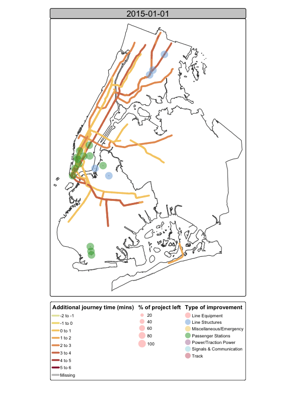

MTA Data Challenge
================
Safiya Sirota & Meghan Timmons
2024-10-12

Libraries

``` r
library(tidyverse)
```

    ## ── Attaching core tidyverse packages ──────────────────────── tidyverse 2.0.0 ──
    ## ✔ dplyr     1.1.4     ✔ readr     2.1.5
    ## ✔ forcats   1.0.0     ✔ stringr   1.5.1
    ## ✔ ggplot2   3.5.1     ✔ tibble    3.2.1
    ## ✔ lubridate 1.9.3     ✔ tidyr     1.3.1
    ## ✔ purrr     1.0.2     
    ## ── Conflicts ────────────────────────────────────────── tidyverse_conflicts() ──
    ## ✖ dplyr::filter() masks stats::filter()
    ## ✖ dplyr::lag()    masks stats::lag()
    ## ℹ Use the conflicted package (<http://conflicted.r-lib.org/>) to force all conflicts to become errors

``` r
library(janitor)
```

    ## 
    ## Attaching package: 'janitor'
    ## 
    ## The following objects are masked from 'package:stats':
    ## 
    ##     chisq.test, fisher.test

``` r
library(sf)
```

    ## Warning: package 'sf' was built under R version 4.4.1

    ## Linking to GEOS 3.11.0, GDAL 3.5.3, PROJ 9.1.0; sf_use_s2() is TRUE

``` r
library(terra)
```

    ## terra 1.7.78
    ## 
    ## Attaching package: 'terra'
    ## 
    ## The following object is masked from 'package:janitor':
    ## 
    ##     crosstab
    ## 
    ## The following object is masked from 'package:tidyr':
    ## 
    ##     extract

``` r
library(spData)
```

    ## Warning: package 'spData' was built under R version 4.4.1

``` r
library(spDataLarge)
```

    ## Warning: package 'spDataLarge' was built under R version 4.4.1

``` r
library(tmap)
```

    ## Warning: package 'tmap' was built under R version 4.4.1

    ## 
    ## Attaching package: 'tmap'
    ## 
    ## The following object is masked from 'package:datasets':
    ## 
    ##     rivers

``` r
library(leaflet)
library(knitr)
```

    ## 
    ## Attaching package: 'knitr'
    ## 
    ## The following object is masked from 'package:terra':
    ## 
    ##     spin

Load in data and join

``` r
location <- read_csv("data/project_locations.csv") %>% 
  clean_names()
```

    ## Rows: 5599 Columns: 12
    ## ── Column specification ────────────────────────────────────────────────────────
    ## Delimiter: ","
    ## chr (8): Project Number, Capital Plan, Agency Name, Category Description, El...
    ## dbl (4): Project Number Sequence, Plan Series, Latitude, Longitude
    ## 
    ## ℹ Use `spec()` to retrieve the full column specification for this data.
    ## ℹ Specify the column types or set `show_col_types = FALSE` to quiet this message.

``` r
summary <- read_csv("data/project_summary.csv") %>% 
  clean_names() %>% 
  select(-c("agency_name", "category_description", 
            "element_description", "project_description",
            "location_indicator", "capital_plan"))
```

    ## Warning: One or more parsing issues, call `problems()` on your data frame for details,
    ## e.g.:
    ##   dat <- vroom(...)
    ##   problems(dat)

    ## Rows: 63799 Columns: 39
    ## ── Column specification ────────────────────────────────────────────────────────
    ## Delimiter: ","
    ## chr (21): Project Number, Capital Plan, Plan Revision Display Keys, Agency C...
    ## dbl (17): Load Date, Original Budget, Current Budget, Original Budget vs Cur...
    ## num  (1): Plan Revision Keys
    ## 
    ## ℹ Use `spec()` to retrieve the full column specification for this data.
    ## ℹ Specify the column types or set `show_col_types = FALSE` to quiet this message.

``` r
project_data <- location %>% 
  left_join(summary, by = "project_number") %>% 
  filter(current_quarter_flag == "CQ") %>% 
  filter(agency_name == "New York City Transit") %>% 
  mutate(category_description = 
           case_when(category_description %in% 
                       c("SIGNALS & COMMUNICATIONS",
                         "SIGNALS AND COMMUNICATIONS") ~ 
                       "SIGNALS & COMMUNICATION",
                     category_description == "MISC./EMERGENCY" ~ 
                       "MISCELLANEOUS",
                     category_description %in% c("SHOPS AND YARDS", "YARDS") ~
                       "SHOPS & YARDS",
                     TRUE ~ category_description)
  )
```

    ## Warning in left_join(., summary, by = "project_number"): Detected an unexpected many-to-many relationship between `x` and `y`.
    ## ℹ Row 1 of `x` matches multiple rows in `y`.
    ## ℹ Row 46100 of `y` matches multiple rows in `x`.
    ## ℹ If a many-to-many relationship is expected, set `relationship =
    ##   "many-to-many"` to silence this warning.

``` r
project_data <- project_data %>% 
  mutate(project_id = paste(project_number, project_number_sequence, sep = "")) %>% 
  mutate(year = current_start_year) %>% 
  filter(!is.na(year),
         !is.na(current_completion_year))

for (i in unique(project_data$project_id)) {
  # get number of years project is active
  curr_row_num <- which(project_data$project_id == i)
  curr_row <- project_data[curr_row_num,]
  start <- project_data$current_start_year[curr_row_num]
  end <- project_data$current_completion_year[curr_row_num]
  num_years <- end - start
  for (j in 1:num_years) {
    curr_row$year <- start + j
    project_data[nrow(project_data) + 1,] = curr_row
  }
}
```

How many types of projects are there?

``` r
unique(project_data$category_description)
```

    ##  [1] "LINE EQUIPMENT"          "LINE STRUCTURES"        
    ##  [3] "PASSENGER STATIONS"      "SIGNALS & COMMUNICATION"
    ##  [5] "MISCELLANEOUS"           "DEPOTS"                 
    ##  [7] "SHOPS & YARDS"           "TRACTION POWER"         
    ##  [9] "TRACK"                   "POWER"                  
    ## [11] "BUSES"

Mapping

Data for NYC
<https://data.cityofnewyork.us/City-Government/Borough-Boundaries/tqmj-j8zm>

``` r
nyc <- st_read("nyc_base_map/nyc.shp")
```

    ## Reading layer `nyc' from data source 
    ##   `/Users/safiyasirota/Desktop/mta_challenge/nyc_base_map/nyc.shp' 
    ##   using driver `ESRI Shapefile'
    ## Simple feature collection with 5 features and 4 fields
    ## Geometry type: MULTIPOLYGON
    ## Dimension:     XY
    ## Bounding box:  xmin: -74.25559 ymin: 40.49613 xmax: -73.70001 ymax: 40.91553
    ## Geodetic CRS:  WGS84(DD)

``` r
# ggplot(nyc) +
#   geom_sf() +
#   geom_sf(data = proj_locs, aes(color = category_description ), size = 1, ,
#           alpha = 0.1) +
#   coord_sf(xlim = c(-74.3 , -73.7), ylim = c(40.45, 40.92), expand = F) +
#   theme_bw() +
#   theme(legend.position="none")

proj_locs <- st_as_sf(project_data, coords = c("longitude", "latitude"), 
                      crs = 4326, agr = "constant")

urb_anim <- tm_shape(nyc) + tm_polygons() + 
  tm_shape(proj_locs) + tm_symbols(fill = "category_description") +
  tm_legend(show=FALSE) +
  tm_facets_wrap(by = "year", 
                 nrow = 1, ncol = 1, free.coords = FALSE) 


tmap_animation(urb_anim, filename = "urb_anim.gif", delay = 25)
```

    ## Creating frames

    ## 

    ## ── tmap v3 code detected ───────────────────────────────────────────────────────

    ## [v3->v4] `tm_legend()`: use 'tm_legend()' inside a layer function, e.g.
    ## 'tm_polygons(..., fill.legend = tm_legend())'
    ## This message is displayed once every 8 hours.

    ## 
    ## Creating animation
    ## Animation saved to /Users/safiyasirota/Desktop/mta_challenge/urb_anim.gif

``` r

```

<!-- -->
